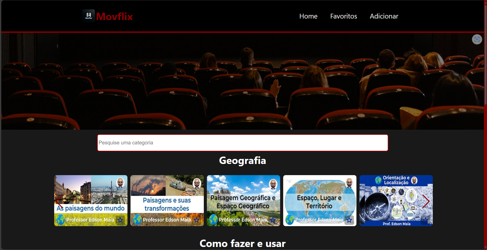

<h1 align='center'>
    MovFlix Web
    <br />
    <br />
    
</h1>

## Apresentação
O [MovFlix](https://movflix-web.vercel.app/) foi o meu primeiro projeto desenvolvido com React. Foi idealizado pelo [professor Edson Maia](https://www.youtube.com/c/professoredsonmaia) em seu curso de React.

Meu objetivo geral, ao criar o projeto, foi estudar e praticar essa tecnologia, o que me deu vontade de continuar me aprofundando em programação. Por isso, mesmo que não tenha um código tão limpo e otimizado, deixo aqui um destaque para esse projeto.

## 🧪 Tecnologias
O MovFlix Web foi produzido apenas com [React](https://react.dev/).

## 🚀 Como Executar
O projeto foi desenvolvido usando Create React App, portanto, para excutá-lo, siga os seguintes passos:
```bash
$ git clone https://github.com/pdanmt/MovFlix-web
$ cd MovFlix-web
```
E, para inicializá-lo, utilize o npm:
```bash
# Instale as dependências
$ npm i

# Execute o projeto
$ npm start
```
O projeto será aberto no seu navegador no endereço http://localhost:3000/
